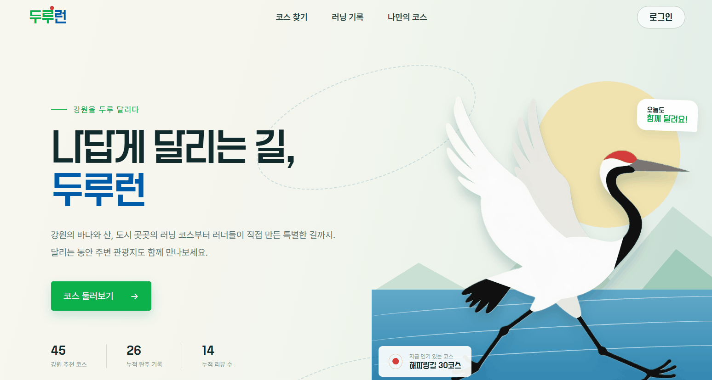
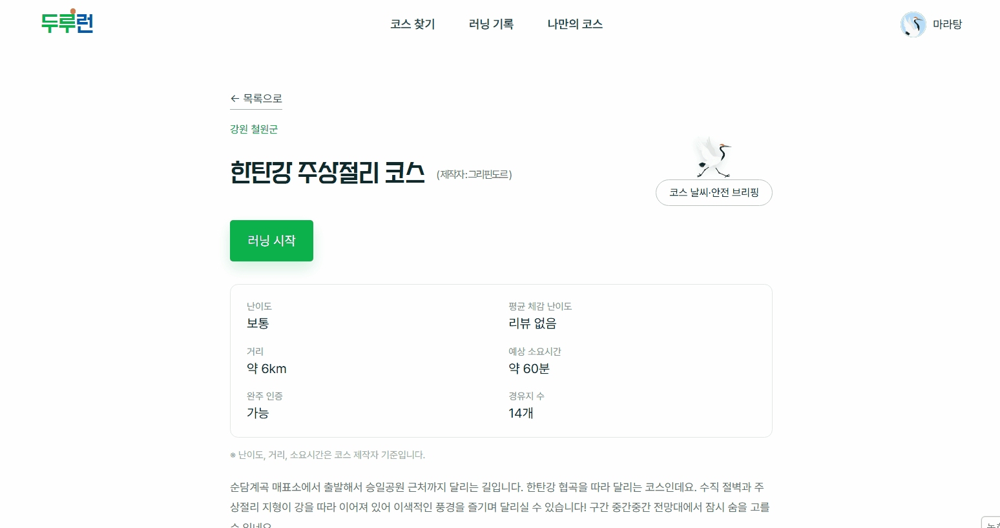
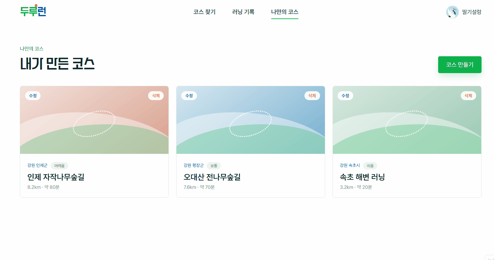
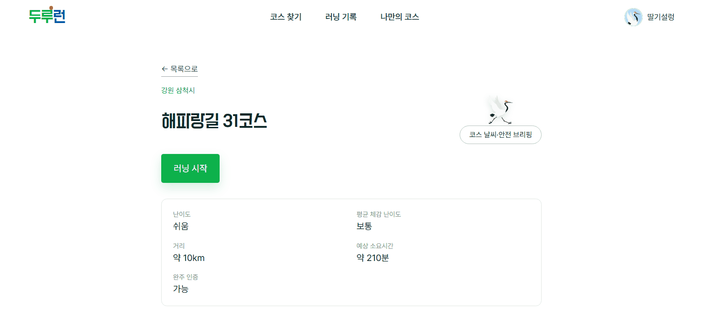
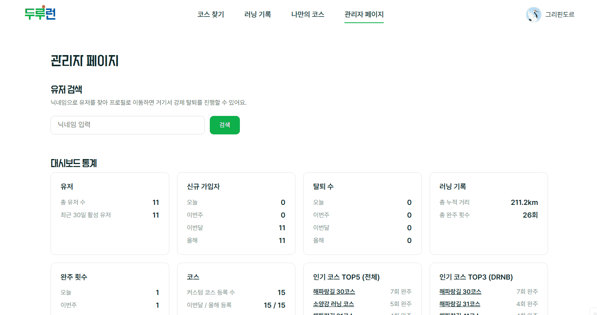
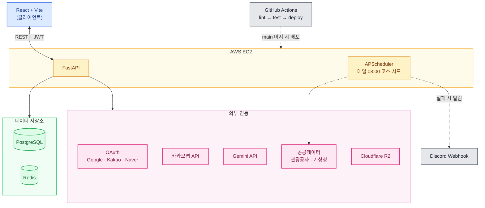

# 두루런 (Duroorun)
<sub>강원도를 상징하는 새 "두루미"처럼, 강원도 곳곳을 두루두루 달려요 !</sub>

> **배포 URL** : https://duroorun.duckdns.org

강원도 러닝 서비스 — 두루누비 공식 코스 탐색, 커스텀 코스 생성, 러닝 기록 관리

---

## 목차

1. &nbsp;[공모전 정보](#공모전-정보)&nbsp;&nbsp;·&nbsp;&nbsp;[팀 구성](#팀-구성)
2. &nbsp;[데모](#데모)&nbsp;&nbsp;·&nbsp;&nbsp;[주요 기능](#주요-기능)&nbsp;&nbsp;·&nbsp;&nbsp;[기술 스택](#기술-스택)&nbsp;&nbsp;·&nbsp;&nbsp;[아키텍처](#아키텍처)
3. &nbsp;[문서](#문서)&nbsp;&nbsp;·&nbsp;&nbsp;[테스트](#테스트)&nbsp;&nbsp;·&nbsp;&nbsp;[프로젝트 구조](#프로젝트-구조)
4. &nbsp;[초기 세팅](#초기-세팅-최초-1회)&nbsp;&nbsp;·&nbsp;&nbsp;[로컬 실행](#로컬-실행)&nbsp;&nbsp;·&nbsp;&nbsp;[API 문서](#api-문서)&nbsp;&nbsp;·&nbsp;&nbsp;[배포 체크리스트](#배포-체크리스트)
5. &nbsp;[**내 담당 기능 상세**](#내-담당-기능-상세)&nbsp;&nbsp;·&nbsp;&nbsp;[**코드리뷰 & 트러블슈팅**](#코드리뷰--트러블슈팅)&nbsp;&nbsp;·&nbsp;&nbsp;[회고](#회고)

---

## 공모전 정보

| 항목 | 내용 |
|------|------|
| 공모전명 | 2026 관광데이터 활용 공모전 (웹·앱 개발 부문) |
| 주관 | 한국관광공사 × Kakao |
| 공식 개발 기간 | 2026.05.20 ~ 2026.09.21 |
| 실제 개발 기간 | 2026.06 ~ 2026.09 (약 3개월, 커밋 기준) |
| 진행 상태 | 제출 완료 |

> [!IMPORTANT]
> 두루누비 코스 데이터를 실시간 호출이 아닌 1일 1회 스케줄러 방식으로 활용하기 위해 한국관광공사에 별도 승인을 신청해 승인받았습니다 (2026-08-21 승인 완료). 신청서 및 승인 메일 원본은 [`docs/`](./docs/) 폴더 참고. + 국문관광정보 API는 실시간 호출 사용중

---

## 팀 구성

[원본 팀 레포](https://github.com/kittyjoa/duroorun)

| 이름 | 역할 | 담당 도메인 |
|------|------|------------|
| [도희 (팀장)](https://github.com/kittyjoa) | 풀스택 | 회원(인증)/관리자/배포 |
| [지영](https://github.com/battlegroundcallofduty) | 풀스택 | 코스 / 편의시설 |
| [유선](https://github.com/kimyuseon) | 풀스택 | 기록/리뷰+이미지 |

---

## 데모

<table>
  <tr><th align="center">1. 로그인 → 코스 목록/필터 → 코스 상세</th></tr>
  <tr><td align="center"></td></tr>
  <tr><th align="center">2. AI 코스 날씨·안전 브리핑</th></tr>
  <tr><td align="center"></td></tr>
  <tr><th align="center">3. 커스텀 코스 생성</th></tr>
  <tr><td align="center"></td></tr>
  <tr><th align="center">4. 러닝 시작 → 완주 인증 → 리뷰 작성(AI 요약)</th></tr>
  <tr><td align="center"></td></tr>
  <tr><th align="center">5. 관리자 페이지 (코스/편의시설 관리, 대시보드)</th></tr>
  <tr><td align="center"></td></tr>
</table>

---

## 주요 기능

- **회원 (인증)** — Google / Kakao / Naver 소셜 로그인 전용
- **프로필 (마이페이지)** — 내 리뷰 관리, 닉네임, 거주지, 회원 탈퇴
- **코스** — 두루누비 공식 코스(해파랑길, DMZ) 탐색 + 커스텀 코스 생성(강원도 전역), AI 코스 날씨·안전 브리핑, 시작/종료 지점 주변 관광지 추천
- **러닝 기록** — GPS 기반 시작/일시정지/재시작/종료, 시작·종료 좌표 및 시간 기준 완주 인증
- **리뷰** — 코스별 리뷰 작성(사진 포함), 리뷰 3개 이상부터 AI 요약 제공
- **편의시설** — 코스 반경 내(시작·종료 좌표 근처) 화장실, 주차장 등 지도 표시
- **관리자** — 대시보드 통계, 코스·편의시설 관리, 유저 강제탈퇴/밴 관리, 유저 프로필 통해 리뷰 삭제

> 화면별 상세 동작과 비즈니스 로직은 [FEATURES.md](./FEATURES.md) 참고.

---

## 기술 스택

### Backend


### Authentication


### Frontend


### Maps & Geolocation


### AI


### 공공데이터 (한국관광공사 · 기상청)
> 4개 API 모두 [data.go.kr](https://www.data.go.kr) 공공데이터포털을 통해 별도 승인받아 사용 중입니다.


### Infrastructure & Deployment


### Testing & Linting


> [!NOTE]
> 한국교통안전공단 주차정보 API(`app/scripts/seed_facilities_parking.py`)는 응답 불안정으로 운영 서버 스케줄러에는 등록하지 않았습니다. 자세한 내용은 [FEATURES.md](./FEATURES.md) 참고.

---

## 아키텍처



---

## 문서

| 문서 | 내용 |
|------|------|
| [FEATURES.md](./FEATURES.md) | 전체 기능 명세 — 화면별 동작, 비즈니스 로직, 결정 배경 |
| [DATABASE.md](./DATABASE.md) | DB 스키마 설계, 테이블 상세, 마이그레이션 운영 방법 |
| [DESIGN.md](./DESIGN.md) | 디자인 가이드 — 브랜드 컬러, 타이포그래피, 화면 구조 |
| [CONTRIBUTING.md](./CONTRIBUTING.md) | 코딩 컨벤션, Git/PR 작업 규칙, 보안 유의사항 |

---

## 테스트

pytest 기반, 도메인별로 분리되어 있습니다 (총 31개 파일).

### 실행 방법

```bash
pytest
```

> CI(`.github/workflows/deploy.yml`)에서도 동일하게 실행됩니다 — postgres + redis 서비스 컨테이너를 띄우고 `alembic upgrade head` 후 `pytest`. `lint` → `test` 잡을 모두 통과해야 `deploy` 잡이 실행됩니다.

### 커버 범위 요약

| 도메인 | 파일 수 | 주요 검증 내용 |
|--------|:---:|------|
| 회원/인증 | 4 | 소셜 로그인, 토큰 재발급/로그아웃/탈퇴, OAuth 콜백 신규/기존 유저 분기, 보안 헬퍼 |
| 코스 | 3 | 커스텀 코스, 랜딩 통계, 두루누비 시드 upsert(관리자 잠금 존중) |
| 러닝 기록 | 4 | pause/resume/end 동시 요청, 중복 시작 방지, 기록 응답 정합성 |
| 리뷰 | 10 | 수정/삭제 권한, 동시성(이미지 업로드/작성 제한/1코스 1리뷰), R2 업로드 롤백, AI 요약 임계값·락·쿨다운 |
| 편의시설 | 1 | 관리자 잠금(`is_admin_edited`), 반경 매칭 포함/제외 override |
| 날씨(AI 브리핑) | 6 | 기상청 격자좌표 변환, 특보 파싱, 캐시 스키마 불일치 복구, 순수 함수(condition/tip) |
| 관광지 추천 | 1 | 기본 조회, 부분 실패 스킵, rate limit·일일 쿼터 |
| 관리자 | 2 | 강제 탈퇴/밴 관리, 대시보드 통계, 라우터 권한 |

---

## 프로젝트 구조

```
app/
├── main.py                  # FastAPI 앱 진입점
├── config.py                # 환경변수 설정
├── database.py               # DB 연결 관리
├── redis.py                  # Redis 연결 관리
├── core/
│   └── security.py          # JWT 발급/검증, 블랙리스트
├── api/v1/
│   └── router.py             # API 라우터 통합
├── domain/
│   ├── user/                # 회원/인증/관리자
│   │   ├── models.py
│   │   ├── schemas.py
│   │   ├── router.py
│   │   └── service.py
│   ├── course/               # 코스 (DRNB + 커스텀)
│   │   ├── models.py
│   │   ├── schemas.py
│   │   ├── router.py
│   │   └── service.py
│   ├── record/               # 러닝 기록
│   │   ├── models.py
│   │   ├── schemas.py
│   │   ├── router.py
│   │   └── service.py
│   ├── review/                # 리뷰 + 이미지
│   │   ├── models.py
│   │   ├── schemas.py
│   │   ├── router.py
│   │   └── service.py
│   ├── facility/              # 편의시설
│   │   ├── models.py
│   │   ├── schemas.py
│   │   ├── router.py
│   │   └── service.py
│   └── admin/                # 관리자 대시보드
│       ├── router.py
│       └── service.py
├── clients/
│   ├── r2.py                 # Cloudflare R2 파일 업로드/삭제
│   ├── durunubi.py            # 두루누비 API 연동 (캐싱 없이 시드 스크립트가 배치 호출)
│   └── gemini.py              # Gemini API 연동 (리뷰 요약 생성)
└── scripts/
    ├── seed_courses.py       # 두루누비 코스 시드 스크립트 (스케줄러가 매일 08:00 자동 실행)
    └── seed_dummy_data.py     # 공모전 데모용 더미 데이터 시딩 스크립트

frontend/                    # 프론트엔드 (React + Vite)
├── public/
├── src/
│   ├── main.jsx              # 앱 진입점
│   ├── App.jsx                # 라우터 설정
│   ├── api/                   # API 호출 함수
│   │   └── index.js           # 공통 API 헬퍼 (JWT 자동 포함 + credentials)
│   ├── components/            # 공통 컴포넌트
│   ├── pages/                 # 페이지 컴포넌트
│   │   ├── Login.jsx
│   │   ├── CourseList.jsx
│   │   ├── CourseDetail.jsx
│   │   ├── RecordStart.jsx
│   │   ├── MyPage.jsx
│   │   └── Admin.jsx
│   └── hooks/                 # 커스텀 훅
└── package.json               # Vite 초기화 시 생성

tests/                        # 테스트 (각 도메인 작업 시 추가)
alembic/                      # 마이그레이션 (alembic init 시 생성)

# 루트 설정 파일
.env.example                  # 환경변수 목록 (복사해서 .env로 사용)
.gitignore
requirements.txt              # 파이썬 의존성
pyproject.toml                # Ruff 설정
Dockerfile                    # 백엔드 이미지 (pip 기반)
docker-compose.yml            # PostgreSQL + Redis + 백엔드
alembic.ini                   # Alembic 설정 (alembic init 시 생성)
```

---

## 초기 세팅 (최초 1회)

> ⚠️ `alembic/`과 `frontend/`(Vite)는 레포에 빈 상태이거나 없을 수 있습니다. 아래 명령어로 초기화해야 합니다. (각각 처음 작업하는 사람이 1회 실행 후 커밋하면, 이후 팀원은 pull만 받으면 됩니다.)

### 1. Alembic 초기화 (DB 마이그레이션)

우리는 async SQLAlchemy(psycopg3)를 쓰므로, `alembic init` 후 생성된 `env.py`를 **async용으로 수정**해야 합니다.

```bash
# 1) async 템플릿으로 초기화
alembic init -t async alembic
```

생성된 `alembic/env.py`를 아래처럼 수정합니다.

```python
# alembic/env.py 상단에 추가
from app.config import settings
from app.database import Base
# 모든 모델을 import 해야 autogenerate가 테이블을 인식함
from app.domain.user import models as user_models       # noqa
from app.domain.course import models as course_models    # noqa
from app.domain.record import models as record_models    # noqa
from app.domain.review import models as review_models    # noqa
from app.domain.facility import models as facility_models  # noqa

# target_metadata를 우리 Base로 연결
target_metadata = Base.metadata

# DB URL을 .env에서 읽어오도록 설정 (alembic.ini에 하드코딩하지 않음)
config.set_main_option("sqlalchemy.url", settings.DATABASE_URL)
```

> `alembic init -t async`로 만들면 `run_migrations_online()`이 이미 async로 생성되므로 별도 수정이 거의 없습니다. URL 연결과 모델 import만 챙기면 됩니다.

초기화 후 첫 마이그레이션:

```bash
alembic revision --autogenerate -m "init tables"
alembic upgrade head
```

### 2. 프론트엔드 (Vite + React) 초기화

```bash
# 1) frontend 폴더에 Vite React 프로젝트 생성
npm create vite@latest frontend -- --template react
cd frontend
npm install
```

> `index.html`, `package.json`, `vite.config.js`, `src/main.jsx`, `src/App.jsx`는 **Vite가 자동 생성**합니다 (레포에 빈 파일로 두지 않음 — 충돌 방지). 초기화 후, 우리 폴더 구조(`src/pages/`, `src/api/`, `src/components/`, `src/hooks/`)를 그 위에 얹어 작업하면 됩니다. `src/pages/*.jsx`, `src/api/index.js`는 우리가 작성하는 파일입니다.

생성 후 `vite.config.js`에 백엔드 프록시를 설정합니다. (개발 중 CORS 우회)

```javascript
// vite.config.js
import { defineConfig } from 'vite';
import react from '@vitejs/plugin-react';

export default defineConfig({
  plugins: [react()],
  server: {
    proxy: {
      '/api': {
        target: 'http://localhost:8000',
        changeOrigin: true,
      },
    },
  },
});
```

공통 API 함수(`src/api/index.js`)에는 **httpOnly 쿠키(Refresh Token) 전송을 위해 `credentials: 'include'`를 반드시 포함**합니다.

```javascript
// src/api/index.js (예시)
const apiFetch = async (url, options = {}) => {
  const accessToken = sessionStorage.getItem('accessToken');
  return fetch(`/api${url}`, {
    ...options,
    credentials: 'include', // Refresh 쿠키 전송 필수
    headers: {
      'Content-Type': 'application/json',
      ...(accessToken && { Authorization: `Bearer ${accessToken}` }),
      ...options.headers,
    },
  });
};
```

> 카카오맵을 쓰는 페이지는 `index.html`에 카카오맵 SDK 스크립트를 추가해야 합니다.

---

## 로컬 실행

### 1. 환경 설정

```bash
cp .env.example .env
# .env 파일에서 필요한 값 설정
```

### 2-A. pip으로 실행

```bash
python -m venv venv
source venv/bin/activate  # Windows: venv\Scripts\activate
pip install -r requirements.txt
uvicorn app.main:app --reload --loop none
```

### 2-B. uv로 실행

```bash
uv sync
uv run uvicorn app.main:app --reload --loop none
```

> `--loop none`: uvicorn이 Windows에서 기본으로 강제하는 ProactorEventLoop가 psycopg async 드라이버와 호환되지 않아 추가. `app/main.py`에서 설정한 이벤트 루프 정책을 그대로 쓰게 함 (Mac/Linux는 영향 없음)

### 2-C. Docker로 실행

```bash
docker compose up --build
```

> Redis도 Docker Compose에 포함되어 있어 별도 설치 불필요

### DB 초기화 동작 방식

| 상황 | 동작 |
|------|------|
| 최초 실행 | 서버 시작 시 `alembic upgrade head` 자동 실행 |
| 모델 변경 후 pull | `alembic upgrade head` 수동 실행 필요 |
| 프로덕션 | `deploy.yml`에서 `alembic upgrade head` 자동 실행 |

### 두루누비 코스 시드 데이터 등록

최초 1회 두루누비 API에서 코스 데이터를 가져와 DB에 저장합니다. 두루누비 API 응답에는 시작/종료 좌표 필드가 없으므로, 시드 스크립트가 `gpxpath`(GPX xml URL)를 다운로드·파싱하여 첫/마지막 포인트를 시작/종료 좌표로 추출해 `courses.start_lat/lng`, `end_lat/lng`에 저장합니다. (이 좌표는 완주 인증 검증의 기준점으로 사용)

로컬 DB 저장 방식은 한국관광공사 승인을 받은 방식입니다 (`docs/` 폴더의 신청서/승인 메일 참고). 운영 서버에서는 최초 1회 수동 실행 이후, `app/scheduler.py`가 매일 08:00에 자동으로 재실행해 데이터를 최신화합니다(실패 시 최대 3회 재시도 + 디스코드 알림).

```bash
python -m app.scripts.seed_courses
```

### 공모전 데모용 더미 데이터 등록

`seed_dummy_data.py`는 심사/데모를 위해 기존 유저 계정에 러닝 기록·리뷰 등을 채워 넣는 스크립트입니다. **DB에 미리 정해진 닉네임(바나낭우유 등)으로 소셜 로그인한 유저가 존재해야 동작**합니다(신규 유저를 생성하지는 않음).

```bash
python -m app.scripts.seed_dummy_data
```

### 모델/DB 스키마가 바뀐 직후 pull 받았을 때

```bash
alembic upgrade head
```

에러가 나거나 DB를 완전히 초기화하고 싶으면:

```bash
# DB 초기화 (로컬)
docker compose down -v
docker compose up --build
```

---

## API 문서

로컬 서버 실행 후 Swagger UI 확인:

- http://localhost:8000/docs

---

## 배포 체크리스트

실제 배포(AWS EC2) 시점에 확인이 필요했던 항목들과 처리 현황입니다.

- ✅ **SameSite 정책**: 프론트/API가 완전히 같은 도메인(`duroorun.duckdns.org`)으로 확정되어 `samesite=lax`로 통일함 (로컬/프로덕션 동일, `secure`만 분기)
- ✅ **운영 환경 `/api` 프록시**: nginx에서 `/api/` → `127.0.0.1:8000` proxy_pass 설정 완료
- ✅ **`COOKIE_DOMAIN`**: 같은 도메인 구조라 비워둠(`domain=None`)이 정답 — 별도 설정 불필요
- ✅ **`JWT_SECRET_KEY` 길이**: 32바이트 이상 새 키로 교체 완료 (로컬/프로덕션 각각 별도 키)
- ✅ **자동화된 인증 테스트**: `tests/` 전체 테스트를 `.github/workflows/deploy.yml`의 `test` 잡(postgres+redis 서비스 컨테이너 + alembic 마이그레이션 후 pytest)으로 CI에 연결함. `lint` → `test` 통과해야 `deploy` 실행됨
- ✅ **`ix_users_nickname_trgm` 인덱스 정상 생성 확인** (`CREATE INDEX CONCURRENTLY`, `53a73e916494`): `SELECT indexrelid::regclass, indisvalid FROM pg_index WHERE indexrelid = 'ix_users_nickname_trgm'::regclass;`로 `indisvalid = true` 확인함

새로 배포 관련 작업을 할 때는 이 섹션에 항목을 추가하고, 처리되면 위처럼 체크 표시로 남겨주세요.

---

## 내 담당 기능 상세

> 담당 도메인: `app/domain/course/`, `app/domain/facility/`, `app/scripts/`, `app/clients/durunubi.py`, `app/clients/kma.py`, `app/clients/tour.py`, `app/clients/gemini.py`(코스 날씨·안전 브리핑 부분), `app/scheduler.py`, `app/clients/discord.py` + 프론트 코스/편의시설/관리자(코스·편의시설) 화면. 기능 명세는 [FEATURES.md](./FEATURES.md), DB 스키마는 [DATABASE.md](./DATABASE.md) 참고.

### 구현한 기능 (코스/편의시설)

**두루누비 공식 코스**
- 배치 시드 스크립트(`app/scripts/seed_courses.py`) — 코스 목록/상세를 요청 시점 실시간 호출 대신 매일 1회 배치로 가져와 DB에 저장, 서비스 조회는 DB만 사용해 API 장애와 무관하게 동작하도록 설계
- API 응답에 없는 시작/종료 좌표를 `gpxpath`(GPX XML) 다운로드·파싱으로 추출해 완주 인증 기준점으로 저장
- 서비스 지역을 강원 해안 6개 시군 → 강원도 전체로 확장, 해파랑길 + DMZ 평화의 길 2개 트레일 전체 수집
- API에서 조회 자체가 안 되는 코스(해파랑길 6개, DMZ 평화의 길 일부)를 `app/scripts/manual_courses.py`로 수동 보완하고, API가 정상화되면 자동으로 API 데이터를 우선하는 병합 로직(`_merge_manual_courses`) 작성
- 관리자가 비활성화한 코스가 다음 배치에서 자동 재활성화되지 않도록 `is_admin_managed` 잠금 구현
- APScheduler로 매일 08:00 자동 재시드 — 시드 함수 자체에 `pg_try_advisory_lock`(DB 세션 레벨 락)을 걸어 여러 워커/프로세스에서 동시에 실행돼도 실제 작업은 한 번만 수행되도록 방지, 실패 시 최대 3회 재시도, 최종 실패 시 Discord Webhook 알림(`app/clients/discord.py`)
- 두루누비 API 활용신청 조건(호출 이력 추적) 충족을 위한 호출 기록 테이블 추가

**커스텀 코스**
- 코스 CRUD(등록/수정/삭제/목록/상세), 경유지(`course_waypoints`) 지도 클릭 기반 입력, 이미지 업로드(Cloudflare R2, 최대 3장/5MB)
- 강원도 경계 판정 — SGIS(통계지리정보) 행정구역 경계 데이터에서 강원도 폴리곤을 추출(`extract_gangwon_boundary.py`)해 `shapely`로 point-in-polygon 판정, 프론트에도 의존성 추가 없이 ray-casting을 직접 구현(`pointInPolygon.js`)해 저장 실패 전에 즉시 안내
- 시작/종료 좌표 기반 시군 자동 태깅(`find_sigungu`) — 외부 지오코딩 API 없이 로컬 폴리곤 판정으로 처리, 지역 필터 제공

**AI 코스 날씨·안전 브리핑**
- 기상청 단기예보/기상특보 조회서비스 연동(`app/clients/kma.py`) — 위경도→격자좌표 변환(단기예보), 특보현황조회(`getPwnStatus`) 텍스트에서 코스의 시군명(`find_sigungu` 결과 재사용)이 포함된 줄만 추출해 관련성 판단
- Gemini API로 원본 기상 데이터를 안내 문구로 가공(`app/clients/gemini.py`)
- Redis 캐싱을 예보(격자 단위, 3시간) / 특보 원문(전역, 5분) / 특보-지역 코멘트(시군+특보해시, 1시간) 3계층으로 분리해 캐시 적중률과 데이터 신선도를 동시에 확보
- 기상청 API 2개 + Gemini 중 하나가 실패해도 나머지는 그대로 표시되도록 방어적 처리

**주변 관광지 추천**
- 한국관광공사 국문관광정보 API 연동(`app/clients/tour.py`) — 공모전 규정상 캐싱 없이 매 조회마다 실시간 호출
- IP당 rate limit + 서버 전역 일일 쿼터 카운터 2중 보호, 시작/종료 지점 중 일부 실패는 조용히 스킵

**편의시설**
- 카카오 로컬 API 키워드 검색 기반 화장실/주차장/편의점 자동 동기화(`sync_nearby_facilities`) — 코스 생성/좌표 수정 시 3개 키워드를 `asyncio.gather`로 병렬 호출
- 반경 기반 자동 매칭으로 전환 — bounding box로 후보를 먼저 좁힌 뒤, 두 지점 사이의 정확한 거리(하버사인 공식으로 지구 곡률까지 반영한 거리)를 계산해 반경 안인지 판정, `course_facility` 매핑 테이블은 포함/제외 예외 전용으로 축소
- 관리자 잠금(`is_admin_edited`) — 비활성화할 때만 잠기고 재활성화하면 풀리는 대칭 구조로 설계, 단순 필드 수정은 잠그지 않아 자동 최신화가 계속 동작하도록 유지
- 한국교통안전공단 주차정보 API 연동 시도(`seed_facilities_parking.py`) — 응답 불안정 확인 후 운영 스케줄러에는 미등록, 필요 시 수동 실행 가능하도록 코드는 보존

**프론트엔드**
- 코스 목록/상세, 나만의 코스(내 커스텀 코스 관리) 페이지
- 커스텀 코스 생성/수정 폼 + 카카오맵 지도 컴포넌트(경유지 클릭 입력, 주소/장소 검색, 강원 경계 폴리곤 검증)
- 코스 상세 편의시설 지도 표시, AI 날씨·안전 브리핑 모달, 주변 관광지 가로 스크롤 카드
- 전체 코스/나만의 코스 목록 공통 무한스크롤("더보기") 훅 — 요청 취소 가드 포함(지금 온 응답이 아직도 유효한 요청의 응답인지 확인)
- 관리자 페이지 코스 관리(활성/비활성) + 편의시설 관리, 페이지네이션·검색 필터

### 기술적 의사결정

| 결정 | 배경 |
|------|------|
| 두루누비 API는 1일 1회 배치로 받아 로컬 DB에 저장 | 한국관광공사 승인 신청서에 적은 이유: ① 두루누비 API에 코스 단건 엔드포인트가 없어 매 요청마다 전체 목록을 순회해야 함 ② 시작/종료 좌표를 얻으려면 코스마다 GPX 파일을 다운로드·파싱해야 하는데, 이 작업을 매 요청마다 하면 응답 지연이 커짐 ③ 완주 기록·편의시설 등 내부 데이터와 관계형으로 연동하려면 안정적인 내부 PK를 가진 로컬 저장소가 필요 ④ 원본 데이터가 하루 1회(오전 07:30 이후)만 갱신되므로, 배치로 같은 주기에 동기화해도 실시간 호출과 데이터 최신성 차이가 실질적으로 없음 |
| 관광지 추천 API는 캐싱 없이 매 조회마다 실시간 호출 | 공모전 규정상 OpenAPI는 로컬 저장/캐싱 없이 실시간 호출 방식으로 활용하도록 권고됨 |
| 날씨는 예보/특보/코멘트를 계층별로 나눠 캐싱 | 예보는 3시간 주기로 갱신되지만, 특보는 언제 발효·해제될지 예측할 수 없는 긴급 정보라 같은 TTL로 묶어서 캐싱하면 안 됨 |
| 코스에 편의시설을 보여주는 방식을 관리자 수동 매핑 → 반경 기반 자동 매칭으로 전환 | 코스가 강원 전체로 확장되고 커스텀 코스가 계속 늘어나는 구조에서, 코스마다 관리자가 일일이 매핑하는 방식은 확장성이 없다고 판단. 지금은 반경 안 시설이 자동으로 노출되고, `course_facility` 매핑은 반경 기준 예외(강제 포함/제외)를 지정하는 용도로만 남음 |
| GPS를 커스텀 코스 생성엔 선택, 러닝 기록 시작엔 필수로 다르게 정책화 | 완주 인증 기준점이 필요한 러닝 기록과 달리, 커스텀 코스 생성은 지도 클릭만으로 완결되므로 GPS를 강제하면 서비스 지역 밖 유저(관광 계획 세우는 외지인)의 접근을 막는 역효과가 있다고 판단 |

### 성능 및 효율

- **편의시설 반경 검색**: 시설 하나하나를 다 정밀 계산하지 않고, 위경도 사각형(bounding box)으로 후보를 크게 좁힌 다음 그 후보들만 정확한 거리(하버사인 공식)로 반경 안인지 확인 — 시설이 많아져도 매번 전체를 다 계산하지 않아 느려지지 않음
- **카카오 키워드 검색 병렬화**: 화장실/주차장/편의점 3개 키워드 검색을 `asyncio.gather`로 동시 호출 — 순차 호출 대비 코스 생성/수정 응답 시간 단축
- **AI 날씨 브리핑 캐싱**: 원본 기상 데이터가 아니라 Gemini가 다듬은 최종 문구까지 캐싱해, 캐시 히트 시 AI 재호출 자체를 생략(캐시를 예보/특보/코멘트 3개로 나눈 이유는 트러블슈팅 7번 참고)
- **관광지 추천 쿼터 보호**: 캐싱이 금지된 API라 IP당 rate limit + 서버 전역 일일 쿼터 카운터로 하루 트래픽 한도(1,000회) 소진을 방지 — 쿼터를 다 쓰면 에러 없이 조용히 카드만 숨김

---

## 코드리뷰 & 트러블슈팅

**1. 두루누비 API 코스 영구 누락**
- **문제**: 해파랑길 6개 코스(29·32·36·37·38·43번)가 API 응답에 아예 조회되지 않음
- **원인**: 처음엔 일시적 API 버그로 의심했으나, 한국관광공사 대외 개방 데이터 운영팀에 직접 문의해 "두루누비 정보 서비스 자체에서 조회 불가능한 데이터"임을 공식 확인(2026-08-24)
- **해결**: `manual_courses.py`로 하드코딩 데이터+GPX 파일을 보완 데이터로 등록. 이후 DMZ 평화의 길 확장 시 동일 패턴(API 누락)이 재발견되어 같은 방식으로 확장하되, 이쪽은 공식 확인 전이라 `_merge_manual_courses`가 API 데이터를 나중에 자동으로 우선하도록 병합 로직 작성
- **결과**: 해당 코스들이 API 상태와 무관하게 항상 서비스에 노출되고, API가 정상화되면 수동 데이터 없이도 자동으로 API 데이터로 전환됨

**2. 강원도 경계 판정 — 사각형 박스의 오탐**
- **문제**: 커스텀 코스 좌표 검증에 사각형 박스를 썼는데, 강원도가 아닌 좌표(예: 37.5, 127.5)도 통과시키는 오탐 발생
- **원인**: 코드리뷰(2026-09-03) — 사각형은 실제 행정구역 모양을 반영하지 못함
- **해결**: SGIS 행정구역 경계 데이터를 폴리곤으로 추출해 백엔드는 `shapely` point-in-polygon으로 교체, 프론트도 외부 지도/기하 라이브러리 없이 ray-casting(어떤 점에서 한 방향으로 직선을 그었을 때 그 직선이 도형 테두리와 몇 번 만나는지 세어서 안/밖을 판정하는 방법 — 홀수번이면 안, 짝수번이면 밖)을 순수 자바스크립트로 구현해 저장 전에 미리 검증. 기존 박스 로직은 경계 데이터 로드 실패 시에만 쓰는 폴백으로 남김
- **결과**: 오탐 제거. 백엔드-프론트 판정 결과를 별도 검증 스크립트(`verify-point-in-polygon.js`)로 대조해 실사용 범위에서 일치함을 확인

```python
# Before — 강원 본토 박스 + 철원군 별도 박스(모양이 튀어나와 하나로 못 그림)
_GANGWON_MAIN_BOX = {"lat": (36.9, 38.7), "lng": (127.4, 129.5)}
_CHEORWON_BOX = {"lat": (37.95, 38.45), "lng": (127.0, 127.45)}

def _in_box(lat, lng, box):
    return box["lat"][0] <= lat <= box["lat"][1] and box["lng"][0] <= lng <= box["lng"][1]

# After — 실제 경계 폴리곤 (app/domain/course/schemas.py)
def _in_gangwon(lat: float, lng: float) -> bool:
    return _GANGWON_BOUNDARY.covers(Point(lng, lat))  # shapely는 (경도, 위도) 순서
```

**3. 무한스크롤("더보기") 레이스 컨디션**
- **문제**: 탭/필터를 빠르게 전환하면 먼저 보낸 요청의 응답이 나중에 도착해 최신 목록을 덮어쓰는 현상, 코스 삭제 후에도 목록에 항목이 그대로 남는 현상, 더보기 실패 후 재시도가 안 되는 현상이 각각 발견됨
- **원인**: 요청 취소/순서 보장 없이 응답이 오는 순서대로 상태를 덮어쓰는 구조였고, 실패 상태를 별도로 관리하지 않음
- **해결**: 요청 취소 가드가 포함된 공통 페이지네이션 훅으로 전체 코스/나만의 코스 목록을 통일하고, 리뷰 도메인의 검증된 방식과 다시 비교해 재정렬
- **결과**: 필터 전환/삭제/재시도 시나리오에서 화면과 실제 데이터 불일치 제거

```javascript
// frontend/src/hooks/useLoadMoreCourses.js
const myRequestId = ++requestIdRef.current;
// ...응답 도착 후
if (requestIdRef.current !== myRequestId) return true; // 이미 낡은 요청이면 결과 버림
```

**4. 편의시설 관리자 잠금 재설계**
- **문제**: 관리자가 편의시설을 한 번이라도 수정하면 그 시설이 자동 재시드 대상에서 영구히 제외됨
- **원인**: 2026-09-13 최초 설계가 "관리자가 뭐라도 한 번 손대면 무조건 영구 잠금"이었고, 풀 방법이 없어 단순 오타 수정만 해도 자동 갱신 대상에서 영영 빠지는 구조였음
- **해결**: 코스의 `is_admin_managed`와 동일하게 "비활성화 시에만 잠기고, 재활성화하면 잠금도 해제"되는 대칭 구조로 재설계
- **결과**: 관리자가 단순 필드만 고친 시설은 계속 자동 최신화되고, 의도적으로 비활성화한 시설만 자동 재시드에서 제외됨

```python
# app/domain/facility/service.py, update_facility()
if "is_active" in update_data:
    facility.is_admin_edited = not update_data["is_active"]  # 비활성화=잠금, 활성화=해제
```

**5. 한국교통안전공단 주차 API 신뢰성 문제**
- **문제**: 정식 승인까지 받은 주차정보 API가 운영 중 예측 불가능하게 응답을 못 줌
- **원인**: 실측 결과 페이지/시간대와 무관하게 무작위로 실패하는 것을 확인 — 신뢰할 수 없는 외부 의존성으로 판단
- **해결**: 운영 서버 스케줄러에는 등록하지 않고, 화장실/편의점과 동일한 카카오 로컬 API 키워드 검색으로 대체. 기존 코드는 삭제하지 않고 API가 안정화될 경우를 대비해 수동 실행용으로 보존
- **결과**: 주차장 데이터 수집이 카카오 검색 기반으로 안정화, 원래 API는 향후 재검토 가능한 상태로 보존됨

**6. 스케줄러 안정성**
- **문제**: 배치 시드 스케줄러가 재등록 시 `ConflictingIdError`를 던지거나, 특정 조건에서 잡이 아예 실행되지 않을 수 있었음
- **원인**: 코드리뷰로 `add_job` 재호출 시 `ConflictingIdError` 발생 가능성 발견. 또한 `next_run_time=None`을 명시적으로 넘기면 APScheduler가 그 잡을 다시는 실행하지 않는 특성이 있어, 이 값을 잘못 넘기면 잡이 조용히 멈출 위험이 있었음
- **해결**: `add_job(replace_existing=True)`로 재등록 충돌을 방지하고, 기동 즉시 실행이 필요할 때만 `next_run_time`을 넘기고 그 외에는 아예 넘기지 않아 트리거가 다음 실행 시각을 스스로 계산하게 함. 실제 시드 작업에는 `seed_courses()` 내부에 `pg_try_advisory_lock`을 걸어 여러 프로세스가 동시에 실행돼도 중복 작업 없이 하나만 실제로 수행됨. 실패 시 최대 3회 재시도, 최종 실패 시 Discord 알림 추가
- **결과**: 매일 08:00 자동 재시드가 등록 오류나 무동작 없이 안정적으로 동작, 실패 시에도 팀이 즉시 인지 가능. 단, 스케줄러 자체는 현재 배포 구성(uvicorn worker 1개)을 전제로 동작해서, 워커/컨테이너를 여러 개로 늘리는 시점엔 별도 워커 프로세스 분리나 분산 락이 추가로 필요함

```python
# app/scheduler.py
job_kwargs = {"next_run_time": datetime.now(KST)} if settings.SEED_ON_STARTUP else {}
_scheduler.add_job(
    _run_seed_courses_with_retry,
    trigger=CronTrigger(hour=8, minute=0, timezone=KST),
    id=_JOB_ID,
    replace_existing=True,  # ConflictingIdError 방지
    **job_kwargs,           # next_run_time=None을 아예 안 넘김
)
```

**7. AI 날씨 브리핑 캐시 정확도**
- **문제**: 이미 해제된 기상특보를 캐시가 계속 안내하는 문제 발견
- **원인**: 특보 원문을 캐싱하는 조회 방식이 "일부 해제"된 상황을 반영하지 못함
- **해결**: 특보 조회 방식을 "특보현황조회"로 변경하고, 예보/특보/특보-지역 코멘트 캐시를 분리해 각각 다른 TTL로 재설계. 네트워크 오류 발생 시 날씨 재조회 로직도 추가
- **결과**: 해제된 특보를 잘못 안내하는 문제 제거, 캐시 계층 분리로 신선도와 적중률을 동시에 확보

---

## 회고

#### 배운 점/느낀 점

- **API 목록에서 시작하는 기획**: 이번 공모전처럼 정해진 OpenAPI 목록이 기획의 전제조건이 되는 프로젝트는 처음이었습니다. 단순히 아이디어에서 시작하는 게 아니라 "어떤 API를 어떻게 활용할 것인가"에서 출발하는 방식이 신선했습니다.
- **PR 코드리뷰 협업 규칙**: 각자 작업이 끝나고 PR을 올리면 서로 꼼꼼히 코드리뷰를 해줬습니다. 시작부터 끝까지 성실하게 지킨 협업 규칙이었고, 서로의 코드리뷰 덕분에 안전하게 개선되어 나갔다고 생각합니다.
- **커밋/PR 태그 컨벤션**: 커밋·PR 메시지의 태그 규칙이 초반 README와 CONTRIBUTING 문서에 서로 다르게 적혀 있었습니다. 저는 초반 README 기준으로, 다른 팀원들은 CONTRIBUTING 기준으로 작업했습니다. 프로젝트 초기에 컨벤션을 명확히 통일해두는 작업이 꼭 필요하다는 것을 깨달았습니다.
- **백필 스크립트의 필요성**: 편의시설 자동 동기화 기능을 나중에 추가했을 때, 그 시점 이전에 만들어진 코스들에는 편의시설이 연결돼 있지 않았습니다. 그래서 기존 코스를 대상으로 실행하는 백필 스크립트(`backfill_facilities.py`)를 작성해야 했고, 기능이나 필드가 새로 추가될 때마다 기존 데이터들도 고려해야 한다는 것을 배웠습니다.
- **`package.json`과 `package-lock.json`의 차이**: `package.json`은 사람이 보는 용도로 "이 프로젝트에서 뭘 쓰기로 했는지"를 느슨한 범위로 적어두는 파일이고, `package-lock.json`은 npm이 그걸 보고 실제 설치 범위를 정확히 계산해서 만드는 결과물이라는 걸 이번에 리액트 프로젝트를 하면서 알게 되었습니다.
- **Alembic 마이그레이션 브랜치 충돌 해결**: 아직 푸시하지 않은 마이그레이션 파일은 하나로 합칠 수 있다는 것, 그리고 같은 마이그레이션에서 두 갈래로 분기된 상황이 생기면 Alembic이 멀티 head를 합치는 전용 명령어(`alembic merge`)를 제공한다는 걸 배웠습니다.
- **TOCTOU**: 레이스 컨디션(경쟁상태) 관련 코드리뷰를 받으면서 "검사 시점과 사용 시점 사이의 간격에서 발생할 수 있는 취약점"을 뜻하는 이 용어를 익혔습니다. ㅡ 실제 예시: "비활성 시설을 찾아서 재활성화"하는 로직에서 존재 확인과 실제 처리 사이에 다른 요청이 끼어들 수 있어, `with_for_update()`로 행 잠금을 걸어 막았습니다.
- **스케줄러의 로컬·배포 환경**: 로컬 서버는 자주 재시작했기 때문에 시작할 때마다 스케줄러가 매번 실행되면 불필요한 API 호출이 반복될 수 있었습니다. 그래서 기동 즉시 실행 여부를 SEED_ON_STARTUP 환경변수로 분리해 기본값을 꺼둔 채로 테스트할 수 있게 만들었습니다. 배포 환경은 매일 08:00 크론(주기)에만 맡기도록 설계했습니다. 로컬과 배포 환경의 조건을 함께 고려하는 것과 그 차이를 환경변수로 유연하게 다룰 수 있다는 것을 배웠습니다.
- **IP당 rate limit이 배포 환경의 프록시 설정에 따라 왜곡 가능**: 배포 서버의 프록시 설정에 따라 실제 사용자와 무관하게 여러 요청이 같은 IP로 잡혀 rate limit이 잘못 계산될 수 있다는 걸 배웠습니다. 배포를 담당한 팀원과 계속 소통하면서 프록시/배포 설정을 함께 해결했습니다.
- **경험을 통해 배포 문제를 사전에 예방**: 이전 인턴 프로젝트에서 혼자 백엔드를 맡았을 때, nginx의 업로드 용량 제한을 서버에서 직접 설정해주지 않아 기본값(1MB)이 그대로 걸려서, 동영상을 업로드해야 했던 팀원이 문제를 겪은 경험이 있었습니다. 이번 공모전 프로젝트도 nginx를 앞단에 쓰고 있어 배포 담당 팀원에게 미리 알려줬고, 실제로 이번에도 한도를 설정해두지 않은 상태였습니다. 문제가 생기기 전에 미리 막을 수 있어서 다행이었습니다.

#### 아쉬웠던 점 (기술적 한계)

- **두루누비 코스 경로 폴리라인 미표시**: 두루누비 API가 `gpxpath`로 GPX 원본을 제공하기 때문에, 지금도 카카오맵에 코스 경로선(폴리라인)을 그려주는 것 자체는 기술적으로 어렵지 않습니다. 이번 버전에 넣지 않은 이유는 기능이 아니라 <ins>완주 인증과의 정합성</ins> 문제였습니다 — 지금 완주 인증은 시작/종료 지점 근접 여부만 검증하는데, 화면에 경로선을 보여주면 유저는 "이 선을 따라가야 인증된다"고 기대하게 됩니다. 실제 검증 로직과 화면이 어긋나는 상태로 내보내는 게 더 안 좋다고 판단해 이번엔 보류했습니다. 다음 디벨롭에서 러닝 중 실시간 GPS 추적(현재는 화면 표시용으로만 씀)을 경로 이탈 검증에도 함께 활용하도록 설계가 확정되면, 그때 코스 폴리라인 표시를 같이 넣어야 한다고 생각합니다.
- **편의시설 자동 동기화가 아직 동기 구조**: 코스 생성/수정 시 카카오 검색(최대 6회 호출)이 다 끝나야 응답이 나가는 구조라, 코스가 많아지면 저장 응답이 느려질 수 있습니다. 지금 스코프에서는 코스 수가 적어 문제가 안 됐지만, 추후엔 저장 자체는 바로 응답하고 카카오 검색은 백그라운드(`BackgroundTasks` 또는 별도 워커/큐)로 분리해야 합니다.
- **편의시설 재검색이 "코스 단위"라 카카오 API를 불필요하게 반복 호출함**: 지금은 코스마다 카카오 검색을 새로 하는 구조라, 코스가 밀집한 지역은 거의 같은 결과를 코스 수만큼 반복 검색하게 됩니다. "코스 단위"가 아니라 "지역(격자) 단위"로 최근에 이미 훑었는지를 캐싱하는 구조로 바꾸면 불필요한 중복 호출을 줄일 수 있습니다.
- **편의시설 데이터가 한 번 저장되면 오래 갱신 안 될 수 있음**: 재검색 트리거가 "코스 좌표가 바뀔 때"뿐이라, 좌표를 안 건드리는 코스(두루누비 대부분)는 저장 이후 재검색되지 않습니다. 근처 다른 코스가 우연히 갱신되지 않으면 폐업·신규 개업 같은 변화가 반영되지 않습니다. 주기적으로 재검증하는 배치를 하나 더 두거나, 조회 시점마다 실시간으로 확인하는 방식으로 바꾸는 걸 검토해야 합니다(혹은 새로운 api나 다른 방식도 검토).
- **편의시설이 100건 넘으면 정렬이 깨질 수 있는 구조**: 코스 반경 안 편의시설이 100건(페이지 상한)을 넘으면 "가까운 순" 표시가 깨질 수 있습니다. 지금은 가장 시설이 많은 코스도 54건이라 당장은 손대지 않았지만, 시설이나 코스가 더 늘어나면 거리 기준으로 정렬해서 응답하도록 고쳐야 합니다. 시설 수가 많아지면 지금의 bounding box + 파이썬 거리 계산 방식 대신, PostGIS 같은 공간 데이터 전용 인덱스로 옮기는 방법도 고려해볼만 합니다.
- **폼 검증 에러 메시지가 영어 원문 그대로 노출**: 글자수 제한이나 범위 같은 기본 검증을 위반하면 "String should have at most 100 characters" 같은 영어 원문이 커스텀 코스 폼과 편의시설 관리 폼에 그대로 노출됩니다. 크래시 없이 안전하게 처리는 해뒀지만, 다음에는 에러 종류와 제약값을 한글 라벨과 문구로 바꿔주는 공용 유틸을 만들어서 두 폼에 중복으로 있는 처리 로직을 대체하고 싶습니다.

#### 향후 개선 방향

- **AI 날씨·안전 브리핑에 자외선 정보 추가**: 실제 러너분께 자외선 정보도 있으면 좋겠다는 의견을 받았는데, 지금 쓰는 기상청 API에는 그 항목이 없습니다. 다음에는 자외선 지수나 날씨·안전과 관련된 더 유용한 정보들을 제공하는 별도 API를 추가로 연동하는 걸 검토해보고 싶습니다.
- **시간 관계상 구현하지 못한 기능**: 커스텀 코스 제작자가 본인이 만든 코스를 실제로 완주했는지 뱃지로 표시하는 기능, 관리자 페이지 편의시설 관리 화면에서 그 시설과 연결된 코스명을 같이 보여주는 기능, 홈 화면의 두루미 애니메이션, 러닝 기록 중 지도 위에서 현 위치 달리는 캐릭터 표시.
- **앱으로의 전환**: 러닝·위치·GPS가 핵심인 서비스인 만큼, 실제 사용자를 고려하면 웹보다 앱으로 전환하는 게 필수적이라고 생각합니다.
- **팀에서 논의했던 AI 활용 아이디어 후보들**: AI 코스 추천 챗봇, 개인 맞춤 AI 제안(러닝 플랜, 부상 예측, 기록 패턴 분석 등), 커스텀 코스 설명 자동 생성, 리뷰 이미지 vision 검열, 완주 인증샷으로 AI 러닝 카드 만들어 SNS에 공유, 완주 횟수 적은 히든 코스 추천(관광객 분산), 난이도·거리 등 폼을 입력하면 그 조건에 맞춰 AI가 관광 겸 러닝 코스 짜주는 기능
- **서비스 전반 확장 아이디어**: 팀 논의에서 나왔던 개선 방향들입니다 — 사용자 프로필에 선호 난이도·선호 거리·페이스 저장, 관리자 대시보드를 차트 등으로 더 시각적으로 개선, 여러 날에 걸친 러닝 관광 플랫폼으로 발전시켜 주변 숙소 연계나 완주 인증 시 지역 할인쿠폰 같은 체류형 관광까지 확장할 가능성, 달리면서 지역 아이템을 수집하거나 완주 코스별 캐릭터 수집 기능, 러닝 중 음성 가이드, 외국어 지원 등.
