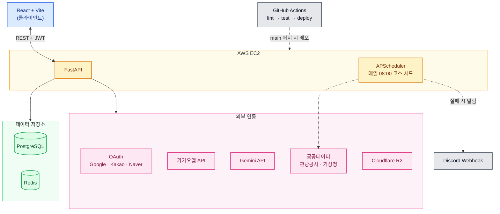

# 두루런 (Duroorun)
<sub>강원도를 상징하는 새 "두루미"처럼, 강원도 곳곳을 두루두루 달려요 !</sub>

> **배포 URL** : https://duroorun.duckdns.org

강원도 러닝 서비스 — 두루누비 공식 코스 탐색, 커스텀 코스 생성, 러닝 기록 관리

---

## 공모전 정보

| 항목 | 내용 |
|------|------|
| 공모전명 | 2026 관광데이터 활용 공모전 (웹·앱 개발 부문) |
| 주관 | 한국관광공사 × Kakao |
| 공식 개발 기간 | 2026.05.20 ~ 2026.09.21 |
| 실제 개발 기간 | 2026.06 ~ 2026.09 (약 3개월, 커밋 기준) |
| 진행 상태 | 제출 완료 |

> [!IMPORTANT]
> 두루누비 코스 데이터를 실시간 호출이 아닌 1일 1회 스케줄러 방식으로 활용하기 위해 한국관광공사에 별도 승인을 신청해 승인받았습니다 (2026-08-21 승인 완료). 신청서 및 승인 메일 원본은 [`docs/`](./docs/) 폴더 참고. + 국문관광정보 API는 실시간 호출 사용중

---

## 팀 구성

| 이름 | 역할 | 담당 도메인 |
|------|------|------------|
| [도희 (팀장)](https://github.com/kittyjoa) | 풀스택 | 회원(인증)/관리자/배포 |
| [지영](https://github.com/battlegroundcallofduty) | 풀스택 | 코스 / 편의시설 |
| [유선](https://github.com/kimyuseon) | 풀스택 | 기록/리뷰+이미지 |

---

## 데모

<table>
  <tr><th align="center">1. 로그인 → 코스 목록/필터 → 코스 상세</th></tr>
  <tr><td align="center"></td></tr>
  <tr><th align="center">2. AI 코스 날씨·안전 브리핑</th></tr>
  <tr><td align="center"></td></tr>
  <tr><th align="center">3. 커스텀 코스 생성</th></tr>
  <tr><td align="center"></td></tr>
  <tr><th align="center">4. 러닝 시작 → 완주 인증 → 리뷰 작성(AI 요약)</th></tr>
  <tr><td align="center"></td></tr>
  <tr><th align="center">5. 관리자 페이지 (코스/편의시설 관리, 대시보드)</th></tr>
  <tr><td align="center"></td></tr>
</table>

---

## 주요 기능

- **회원 (인증)** — Google / Kakao / Naver 소셜 로그인 전용
- **프로필 (마이페이지)** — 내 리뷰 관리, 닉네임, 거주지, 회원 탈퇴
- **코스** — 두루누비 공식 코스(해파랑길, DMZ) 탐색 + 커스텀 코스 생성(강원도 전역), AI 코스 날씨·안전 브리핑, 시작/종료 지점 주변 관광지 추천
- **러닝 기록** — GPS 기반 시작/일시정지/재시작/종료, 시작·종료 좌표 및 시간 기준 완주 인증
- **리뷰** — 코스별 리뷰 작성(사진 포함), 리뷰 3개 이상부터 AI 요약 제공
- **편의시설** — 코스 반경 내(시작·종료 좌표 근처) 화장실, 주차장 등 지도 표시
- **관리자** — 대시보드 통계, 코스·편의시설 관리, 유저 강제탈퇴/밴 관리, 유저 프로필 통해 리뷰 삭제

> 화면별 상세 동작과 비즈니스 로직은 [FEATURES.md](./FEATURES.md) 참고.

---

## 기술 스택

### Backend


### Authentication


### Frontend


### Maps & Geolocation


### AI


### 공공데이터 (한국관광공사 · 기상청)
> 4개 API 모두 [data.go.kr](https://www.data.go.kr) 공공데이터포털을 통해 별도 승인받아 사용 중입니다.


### Infrastructure & Deployment


### Testing & Linting


> [!NOTE]
> 한국교통안전공단 주차정보 API(`app/scripts/seed_facilities_parking.py`)는 응답 불안정으로 운영 서버 스케줄러에는 등록하지 않았습니다. 자세한 내용은 [FEATURES.md](./FEATURES.md) 참고.

---

## 아키텍처



---

## 문서

| 문서 | 내용 |
|------|------|
| [FEATURES.md](./FEATURES.md) | 전체 기능 명세 — 화면별 동작, 비즈니스 로직, 결정 배경 |
| [DATABASE.md](./DATABASE.md) | DB 스키마 설계, 테이블 상세, 마이그레이션 운영 방법 |
| [DESIGN.md](./DESIGN.md) | 디자인 가이드 — 브랜드 컬러, 타이포그래피, 화면 구조 |
| [CONTRIBUTING.md](./CONTRIBUTING.md) | 코딩 컨벤션, Git/PR 작업 규칙, 보안 유의사항 |

---

## 테스트

pytest 기반, 도메인별로 분리되어 있습니다 (총 31개 파일).

### 실행 방법

```bash
pytest
```

> CI(`.github/workflows/deploy.yml`)에서도 동일하게 실행됩니다 — postgres + redis 서비스 컨테이너를 띄우고 `alembic upgrade head` 후 `pytest`. `lint` → `test` 잡을 모두 통과해야 `deploy` 잡이 실행됩니다.

### 커버 범위 요약

| 도메인 | 파일 수 | 주요 검증 내용 |
|--------|:---:|------|
| 회원/인증 | 4 | 소셜 로그인, 토큰 재발급/로그아웃/탈퇴, OAuth 콜백 신규/기존 유저 분기, 보안 헬퍼 |
| 코스 | 3 | 커스텀 코스, 랜딩 통계, 두루누비 시드 upsert(관리자 잠금 존중) |
| 러닝 기록 | 4 | pause/resume/end 동시 요청, 중복 시작 방지, 기록 응답 정합성 |
| 리뷰 | 10 | 수정/삭제 권한, 동시성(이미지 업로드/작성 제한/1코스 1리뷰), R2 업로드 롤백, AI 요약 임계값·락·쿨다운 |
| 편의시설 | 1 | 관리자 잠금(`is_admin_edited`), 반경 매칭 포함/제외 override |
| 날씨(AI 브리핑) | 6 | 기상청 격자좌표 변환, 특보 파싱, 캐시 스키마 불일치 복구, 순수 함수(condition/tip) |
| 관광지 추천 | 1 | 기본 조회, 부분 실패 스킵, rate limit·일일 쿼터 |
| 관리자 | 2 | 강제 탈퇴/밴 관리, 대시보드 통계, 라우터 권한 |

---

## 프로젝트 구조

```
app/
├── main.py                  # FastAPI 앱 진입점
├── config.py                # 환경변수 설정
├── database.py               # DB 연결 관리
├── redis.py                  # Redis 연결 관리
├── core/
│   └── security.py          # JWT 발급/검증, 블랙리스트
├── api/v1/
│   └── router.py             # API 라우터 통합
├── domain/
│   ├── user/                # 회원/인증/관리자
│   │   ├── models.py
│   │   ├── schemas.py
│   │   ├── router.py
│   │   └── service.py
│   ├── course/               # 코스 (DRNB + 커스텀)
│   │   ├── models.py
│   │   ├── schemas.py
│   │   ├── router.py
│   │   └── service.py
│   ├── record/               # 러닝 기록
│   │   ├── models.py
│   │   ├── schemas.py
│   │   ├── router.py
│   │   └── service.py
│   ├── review/                # 리뷰 + 이미지
│   │   ├── models.py
│   │   ├── schemas.py
│   │   ├── router.py
│   │   └── service.py
│   ├── facility/              # 편의시설
│   │   ├── models.py
│   │   ├── schemas.py
│   │   ├── router.py
│   │   └── service.py
│   └── admin/                # 관리자 대시보드
│       ├── router.py
│       └── service.py
├── clients/
│   ├── r2.py                 # Cloudflare R2 파일 업로드/삭제
│   ├── durunubi.py            # 두루누비 API 연동 (캐싱 없이 시드 스크립트가 배치 호출)
│   └── gemini.py              # Gemini API 연동 (리뷰 요약 생성)
└── scripts/
    ├── seed_courses.py       # 두루누비 코스 시드 스크립트 (스케줄러가 매일 08:00 자동 실행)
    └── seed_dummy_data.py     # 공모전 데모용 더미 데이터 시딩 스크립트

frontend/                    # 프론트엔드 (React + Vite)
├── public/
├── src/
│   ├── main.jsx              # 앱 진입점
│   ├── App.jsx                # 라우터 설정
│   ├── api/                   # API 호출 함수
│   │   └── index.js           # 공통 API 헬퍼 (JWT 자동 포함 + credentials)
│   ├── components/            # 공통 컴포넌트
│   ├── pages/                 # 페이지 컴포넌트
│   │   ├── Login.jsx
│   │   ├── CourseList.jsx
│   │   ├── CourseDetail.jsx
│   │   ├── RecordStart.jsx
│   │   ├── MyPage.jsx
│   │   └── Admin.jsx
│   └── hooks/                 # 커스텀 훅
└── package.json               # Vite 초기화 시 생성

tests/                        # 테스트 (각 도메인 작업 시 추가)
alembic/                      # 마이그레이션 (alembic init 시 생성)

# 루트 설정 파일
.env.example                  # 환경변수 목록 (복사해서 .env로 사용)
.gitignore
requirements.txt              # 파이썬 의존성
pyproject.toml                # Ruff 설정
Dockerfile                    # 백엔드 이미지 (pip 기반)
docker-compose.yml            # PostgreSQL + Redis + 백엔드
alembic.ini                   # Alembic 설정 (alembic init 시 생성)
```

---

## 초기 세팅 (최초 1회)

> ⚠️ `alembic/`과 `frontend/`(Vite)는 레포에 빈 상태이거나 없을 수 있습니다. 아래 명령어로 초기화해야 합니다. (각각 처음 작업하는 사람이 1회 실행 후 커밋하면, 이후 팀원은 pull만 받으면 됩니다.)

### 1. Alembic 초기화 (DB 마이그레이션)

우리는 async SQLAlchemy(psycopg3)를 쓰므로, `alembic init` 후 생성된 `env.py`를 **async용으로 수정**해야 합니다.

```bash
# 1) async 템플릿으로 초기화
alembic init -t async alembic
```

생성된 `alembic/env.py`를 아래처럼 수정합니다.

```python
# alembic/env.py 상단에 추가
from app.config import settings
from app.database import Base
# 모든 모델을 import 해야 autogenerate가 테이블을 인식함
from app.domain.user import models as user_models       # noqa
from app.domain.course import models as course_models    # noqa
from app.domain.record import models as record_models    # noqa
from app.domain.review import models as review_models    # noqa
from app.domain.facility import models as facility_models  # noqa

# target_metadata를 우리 Base로 연결
target_metadata = Base.metadata

# DB URL을 .env에서 읽어오도록 설정 (alembic.ini에 하드코딩하지 않음)
config.set_main_option("sqlalchemy.url", settings.DATABASE_URL)
```

> `alembic init -t async`로 만들면 `run_migrations_online()`이 이미 async로 생성되므로 별도 수정이 거의 없습니다. URL 연결과 모델 import만 챙기면 됩니다.

초기화 후 첫 마이그레이션:

```bash
alembic revision --autogenerate -m "init tables"
alembic upgrade head
```

### 2. 프론트엔드 (Vite + React) 초기화

```bash
# 1) frontend 폴더에 Vite React 프로젝트 생성
npm create vite@latest frontend -- --template react
cd frontend
npm install
```

> `index.html`, `package.json`, `vite.config.js`, `src/main.jsx`, `src/App.jsx`는 **Vite가 자동 생성**합니다 (레포에 빈 파일로 두지 않음 — 충돌 방지). 초기화 후, 우리 폴더 구조(`src/pages/`, `src/api/`, `src/components/`, `src/hooks/`)를 그 위에 얹어 작업하면 됩니다. `src/pages/*.jsx`, `src/api/index.js`는 우리가 작성하는 파일입니다.

생성 후 `vite.config.js`에 백엔드 프록시를 설정합니다. (개발 중 CORS 우회)

```javascript
// vite.config.js
import { defineConfig } from 'vite';
import react from '@vitejs/plugin-react';

export default defineConfig({
  plugins: [react()],
  server: {
    proxy: {
      '/api': {
        target: 'http://localhost:8000',
        changeOrigin: true,
      },
    },
  },
});
```

공통 API 함수(`src/api/index.js`)에는 **httpOnly 쿠키(Refresh Token) 전송을 위해 `credentials: 'include'`를 반드시 포함**합니다.

```javascript
// src/api/index.js (예시)
const apiFetch = async (url, options = {}) => {
  const accessToken = sessionStorage.getItem('accessToken');
  return fetch(`/api${url}`, {
    ...options,
    credentials: 'include', // Refresh 쿠키 전송 필수
    headers: {
      'Content-Type': 'application/json',
      ...(accessToken && { Authorization: `Bearer ${accessToken}` }),
      ...options.headers,
    },
  });
};
```

> 카카오맵을 쓰는 페이지는 `index.html`에 카카오맵 SDK 스크립트를 추가해야 합니다.

---

## 로컬 실행

### 1. 환경 설정

```bash
cp .env.example .env
# .env 파일에서 필요한 값 설정
```

### 2-A. pip으로 실행

```bash
python -m venv venv
source venv/bin/activate  # Windows: venv\Scripts\activate
pip install -r requirements.txt
uvicorn app.main:app --reload --loop none
```

### 2-B. uv로 실행

```bash
uv sync
uv run uvicorn app.main:app --reload --loop none
```

> `--loop none`: uvicorn이 Windows에서 기본으로 강제하는 ProactorEventLoop가 psycopg async 드라이버와 호환되지 않아 추가. `app/main.py`에서 설정한 이벤트 루프 정책을 그대로 쓰게 함 (Mac/Linux는 영향 없음)

### 2-C. Docker로 실행

```bash
docker compose up --build
```

> Redis도 Docker Compose에 포함되어 있어 별도 설치 불필요

### DB 초기화 동작 방식

| 상황 | 동작 |
|------|------|
| 최초 실행 | 서버 시작 시 `alembic upgrade head` 자동 실행 |
| 모델 변경 후 pull | `alembic upgrade head` 수동 실행 필요 |
| 프로덕션 | `deploy.yml`에서 `alembic upgrade head` 자동 실행 |

### 두루누비 코스 시드 데이터 등록

최초 1회 두루누비 API에서 코스 데이터를 가져와 DB에 저장합니다. 두루누비 API 응답에는 시작/종료 좌표 필드가 없으므로, 시드 스크립트가 `gpxpath`(GPX xml URL)를 다운로드·파싱하여 첫/마지막 포인트를 시작/종료 좌표로 추출해 `courses.start_lat/lng`, `end_lat/lng`에 저장합니다. (이 좌표는 완주 인증 검증의 기준점으로 사용)

로컬 DB 저장 방식은 한국관광공사 승인을 받은 방식입니다 (`docs/` 폴더의 신청서/승인 메일 참고). 운영 서버에서는 최초 1회 수동 실행 이후, `app/scheduler.py`가 매일 08:00에 자동으로 재실행해 데이터를 최신화합니다(실패 시 최대 3회 재시도 + 디스코드 알림).

```bash
python -m app.scripts.seed_courses
```

### 공모전 데모용 더미 데이터 등록

`seed_dummy_data.py`는 심사/데모를 위해 기존 유저 계정에 러닝 기록·리뷰 등을 채워 넣는 스크립트입니다. **DB에 미리 정해진 닉네임(바나낭우유 등)으로 소셜 로그인한 유저가 존재해야 동작**합니다(신규 유저를 생성하지는 않음).

```bash
python -m app.scripts.seed_dummy_data
```

### 모델/DB 스키마가 바뀐 직후 pull 받았을 때

```bash
alembic upgrade head
```

에러가 나거나 DB를 완전히 초기화하고 싶으면:

```bash
# DB 초기화 (로컬)
docker compose down -v
docker compose up --build
```

---

## API 문서

로컬 서버 실행 후 Swagger UI 확인:

- http://localhost:8000/docs

---

## 배포 체크리스트

실제 배포(AWS EC2) 시점에 확인이 필요했던 항목들과 처리 현황입니다.

- ✅ **SameSite 정책**: 프론트/API가 완전히 같은 도메인(`duroorun.duckdns.org`)으로 확정되어 `samesite=lax`로 통일함 (로컬/프로덕션 동일, `secure`만 분기)
- ✅ **운영 환경 `/api` 프록시**: nginx에서 `/api/` → `127.0.0.1:8000` proxy_pass 설정 완료
- ✅ **`COOKIE_DOMAIN`**: 같은 도메인 구조라 비워둠(`domain=None`)이 정답 — 별도 설정 불필요
- ✅ **`JWT_SECRET_KEY` 길이**: 32바이트 이상 새 키로 교체 완료 (로컬/프로덕션 각각 별도 키)
- ✅ **자동화된 인증 테스트**: `tests/` 전체 테스트를 `.github/workflows/deploy.yml`의 `test` 잡(postgres+redis 서비스 컨테이너 + alembic 마이그레이션 후 pytest)으로 CI에 연결함. `lint` → `test` 통과해야 `deploy` 실행됨
- ✅ **`ix_users_nickname_trgm` 인덱스 정상 생성 확인** (`CREATE INDEX CONCURRENTLY`, `53a73e916494`): `SELECT indexrelid::regclass, indisvalid FROM pg_index WHERE indexrelid = 'ix_users_nickname_trgm'::regclass;`로 `indisvalid = true` 확인함

새로 배포 관련 작업을 할 때는 이 섹션에 항목을 추가하고, 처리되면 위처럼 체크 표시로 남겨주세요.
